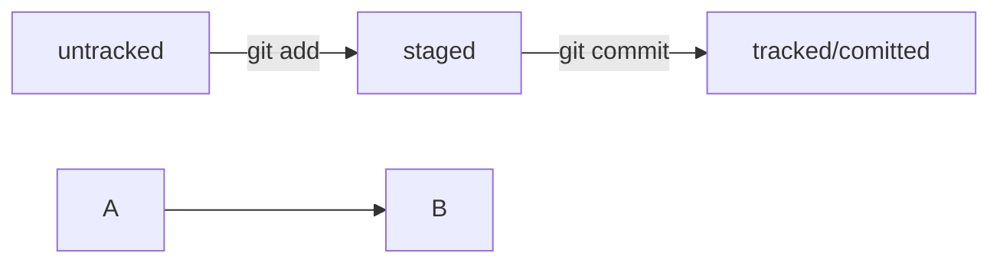

# ШПАРГАЛКА по Git
## СПИСОК основных команд Git:
### git init - инициализация локальной папки для работы с Git
### git add --all - подготовка всех файлов в папке к коммиту
### git commit -m "Сообщение" - коммит (сохранение подготовленых файлов в Git локально)
### git push - размещение сохраненных файлов на GitHub

### HEAD -- это голова.
### Коммит - всему голова.
### Статусы файлов:

